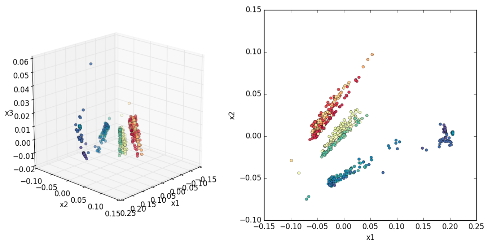
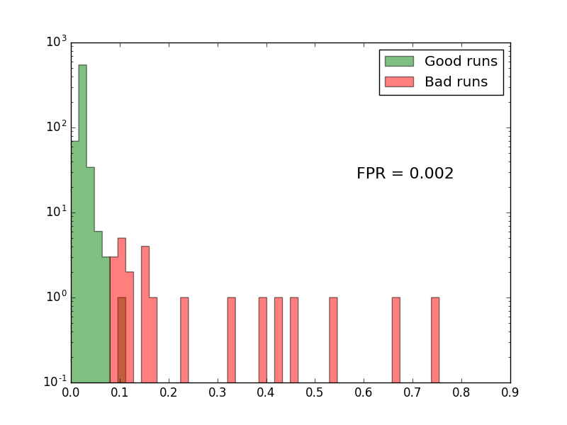

## CSC-DQM-ML

Collection of ML-based tools for automating **D**ata **Q**uality **M**onitoring with 1D histograms.
Originally made for the CSC subgroup of the Muon DPG at CMS, but attempts have been made to keep things 
general for use in other applications. 
[See here](https://drive.google.com/open?id=18OZjYioG4-xLIwSYC0Kh9Yz1Qobsn5KJ) 
for a set of slides on the topic presented at the 
[2018 MLSE conference](https://events.mcs.cmu.edu/mlse/).

<p align="center">

 <br><i>3D and 2D projections of a set of PCA-transformed DQM histograms</i>
</p>

Data Quality Monitoring is an important yet time-consuming task for any particle physics experiment.
For the CSC subsystem at CMS (as well as many other subsystems), the usual workflow is as follows:
* For each "run" (multiple per day), automated scripts produce hundreds of plots relating to the performance of the detector.
* A human user manually sifts through all of these plots, comparing against a suitable reference run.
* The user flags any that look unusual and notifies relevant detector experts to diagnose the problem.

Repeating this each day for many runs is tedious and time-consuming for the user.
Hence, there is an ongoing push to automate this process as much as possible using
both statistical and machine learning-based tools.

Here, we have developed a set of tools for **outlier detection** of 1-dimensional DQM histograms. 
The idea is to flag any that look "unusual" compared to previous runs for further inspection by a human user.

This is done primarily through dimensionality reduction. There is typically not much variation in a
given DQM histogram from run to run, so, thinking of each plot as a point in (*nbins*)-dimensional space,
the entire collection can mostly be described by a handful of "components". After reconstructing
from the reduced histogram, the SSE from the original tells you how "unusual" it is.

### Contents
* `dqmml`
  * Contains main classes for organizing histogram collections and training models to detect outliers.
  * `HistCollection.py` - organize a collection of histograms and "clean" properly (normalize, remove
  bins that are identical between all histograms).
  * `DQMPCA.py` and `DQMAutoEncoder.py` - implementations of PCA (sklearn) and AutoEncoder (tensorflow)
  models for dimensionality reduction.
* `csc`
  * Example implementation of the above, specifically for CSC DQM.
  * `utils.py` - helper functions to load histogram data from a CSC-specific format and store as a `HistCollection`.
  * `data/test` - pickled `HistCollection` objects for two example CSC plots
  * `csc_pca.py` - Full example of loading data, training a `DQMPCA` model, and making some useful plots.
  * `trained_pcas/test` - example pickled trained `DQMPCA` models. The idea would be to load this in the future,
  compare against some new histograms, and flag any above a certain "outlier score".
  
### Example of use
Here we run through `csc/csc_pca.py` for a full example of use.
* Load histograms from disk and store as a `HistCollection`. This part is CSC-specific.
```python
dname, hname = "Segments", "hSTimeCombined"
hc = utils.load_hist_data(dname, hname, lumi_json="run_info.json")
```
* Create a `DQMPCA` object and train on the histogram data. Only use histograms with >10000 entries
(to avoid contaminating with useless low-stats runs). Tell it to save SSE distributions for 1, 2,
and 3 reduced dimensions.
```python
pca = DQMPCA()
pca.fit(hc, norm_cut=10000, sse_ncomps=(1,2,3))
```
* Determine how many components the "reduced" space should have. Here we use the number
required to explain >95% of the variance, capped at 3.
```python
evr = pca.explained_variance_ratio
ncomp = min(np.argmax(np.cumsum(evr)>0.95)+1, 3)
```
* For plotting, compute the transformed histograms, the inverse transformation using 
the number of components computed above, and the SSE and "score" 
(just the percentile within the SSE distribution. Closer to 100 is more "outlier-like").
```python
xf = pca.transform(hc)
ixf = pca.inverse_transform(xf, n_components=ncomp)
sses = pca.sse(hc, n_components=ncomp)
scores = pca.score(hc, n_components=ncomp)
```
* The rest of the code produces a series of plots/visualizations.
The first is the 2-panel plot shown above. These are the 3D and 2D projections of the PCA-transformed histograms,
for the `Segments_hSTimeCombined` plot. Color is by run number (i.e., time. One can see the shift in time of the
histogram).
* The second plot is a visualization of each of the 3 components of the histogram. 
Black is the mean histogram. Blue is the first PCA component, red the second, and green the third.
The red dotted line is the sum of these 3 (the reconstructed histogram using the first 3 principle components).
You can update this plot by clicking anywhere in the 2D panel in the above plot. By doing this, one sees that
the blue (first) component controls the size of the main peak relative to the side peaks. This is essentially
a direct function of the instantaneous luminosity of the run. The second component controls slight horizontal
shifts in the peak locations. This has to do with the CSC timing calibration.
<p align="center">

</p>

* The final plot shows the SSE distribution (this time for the `Digis_hWireTBin_p11b` histogram). In red are
the runs that were marked as anomalous by a human user. One can see that these all have high SSE values, as
desired.
<p align="center">

</p>
